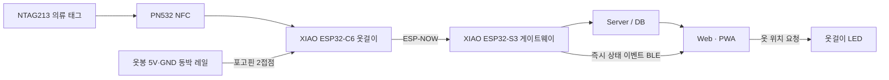

# 👔 OTKOK — 무배터리 스마트 옷장

<div align="center">


**옷을 걸면 자동 등록하고, AI가 추천하며, LED로 위치를 알려주는 실사용형 스마트 옷장 서비스**

[프로젝트 개요](#-프로젝트-개요) • [핵심 기능](#-핵심-기능) • [전원·통신 구조](#-전원통신-아키텍처) • [문제 해결](#-담당-및-문제-해결) • [결과](#-결과와-검증-범위)

</div>

---

## 📌 프로젝트 개요

**OTKOK**은 옷에 부착한 NFC 태그를 옷걸이가 인식하면 옷 정보가 앱에 자동 반영되고, 날씨·TPO에 맞는 옷을 추천하며, 선택한 옷걸이의 LED를 켜 위치를 안내하는 스마트 옷장 서비스입니다.

옷걸이마다 배터리를 충전해야 하는 불편을 없애기 위해 옷봉 자체를 전원 공급 구조로 설계했습니다. NFC 태그부터 옷걸이, 옷봉 게이트웨이, 서버와 앱까지 이어지는 데이터 경로를 구성하고 연구실·기숙사 사용자 환경에 배포해 개선 효과를 점검했습니다.

---

## ✨ 핵심 기능

| 기능 | 동작 |
| --- | --- |
| 자동 옷 등록 | NTAG213 태그를 PN532로 읽어 옷 정보를 앱에 반영 |
| 무배터리 옷걸이 | 옷봉의 5V·GND 동박 레일과 옷걸이 포고핀 접점으로 전원 공급 |
| 옷 추천 | 날씨·TPO 조건에 맞는 옷 추천 |
| 위치 안내 | 사용자가 선택한 옷걸이의 LED 점등 |
| 탈착 감지 | 옷걸이 연결 상태와 heartbeat를 이용해 분리 상태 반영 |

---

## ⚡ 전원·통신 아키텍처



전원은 물리 접점, 데이터는 무선 통신으로 분리했습니다. 이 구조로 옷걸이와 옷봉 사이의 접점을 4개가 아닌 **전원 2개**로 단순화했습니다.

---

## 🔧 담당 및 문제 해결

### 1. 옷걸이별 배터리 관리 문제

- 옷걸이마다 배터리를 충전·교체하는 방식은 다수 기기 운영에 적합하지 않았습니다.
- 옷봉에 **5V·GND 2선 동박 전원 레일**을 설치하고 옷걸이에 스프링 포고핀 접점을 적용했습니다.
- 옷걸이를 옷봉에 거는 동작만으로 전원이 공급되는 무배터리 구조를 구현했습니다.

### 2. 물리 접점 수와 체결 신뢰성 문제

- 전원과 유선 데이터 통신을 함께 사용하면 네 개의 접점을 동시에 맞춰야 했습니다.
- 데이터 통신을 ESP-NOW로 분리해 옷걸이와 옷봉 사이의 물리 접점을 전원 2개로 줄였습니다.
- 전원 공급과 데이터 전달의 역할을 분리해 구조를 단순화했습니다.

### 3. 다중 기기에서 발생한 앱 반영 지연

- 옷걸이 5개 이상을 동시에 사용하자 앱 반영 시간이 약 **2초**까지 늘어났습니다.
- 구간별 로그로 NFC 인식부터 앱 반영까지의 경로를 비교해 서버·DB 경유 구간을 병목으로 좁혔습니다.
- 기록이 필요한 데이터는 기존 경로를 유지하고, 즉시성이 필요한 상태 이벤트만 BLE로 직접 전달해 약 **0.2초**로 단축했습니다.

### 4. 늦은 탈착 상태 반영

- heartbeat 주기 때문에 옷걸이 탈착이 최대 약 **10초** 늦게 반영됐습니다.
- heartbeat 주기와 분리 판정 기준을 조정해 신호 단절 후 약 **1.2초**에 분리 상태를 반영하도록 개선했습니다.

---

## 🧰 기술 구성

| 구분 | 사용 기술 |
| --- | --- |
| Embedded | XIAO ESP32-C6, XIAO ESP32-S3, C/C++ |
| Identification | NTAG213, PN532 NFC |
| Communication | ESP-NOW, BLE |
| Power/Mechanical | 5V·GND 동박 레일, Spring Pogo Pin |
| Service | JavaScript, HTML/CSS, Node.js, Web/PWA, Database |

---

## 📁 저장소 구조

```text
PA/
├── firmware/        # ESP32-C6 옷걸이·ESP32-S3 게이트웨이 펌웨어
├── backend/         # 서비스 백엔드
├── web/             # Web/PWA 사용자 화면
├── simulator/       # 장치 없이 흐름을 점검하는 시뮬레이터
├── tests/           # 소프트웨어 테스트
├── docs/            # 제작·배선·검증 가이드
├── scripts/         # 설치·실행 자동화
└── walkthrough.md   # 구현 및 검증 기록
```

---

## 🚀 빠른 시작

처음 실행한다면 [`docs/00_MASTER_START_TO_FINISH_GUIDE.md`](docs/00_MASTER_START_TO_FINISH_GUIDE.md)를 위에서부터 따라가세요.

```powershell
powershell -ExecutionPolicy Bypass -File scripts/setup.ps1
npm start
```

---

## ✅ 결과와 검증 범위

- 앱 반영 시간: 약 **2초 → 0.2초**
- 탈착 감지 시간: 약 **10초 → 1.2초**
- 연구실·기숙사 사용자 환경에 재배포해 개선 효과 확인
- 공과대학장상 대상 수상

> 위 성능 수치는 프로젝트의 실물 운영 결과입니다. NFC 거리, 포고핀 접점, 전원 용량과 RF 환경은 장비·설치 조건의 영향을 받으므로 저장소 문서에서는 실물 재시험이 필요한 항목을 `REQUIRES_PHYSICAL_TEST`로 구분합니다.
