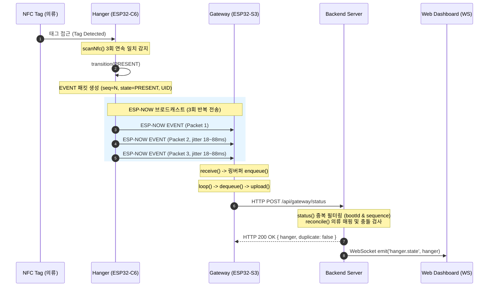
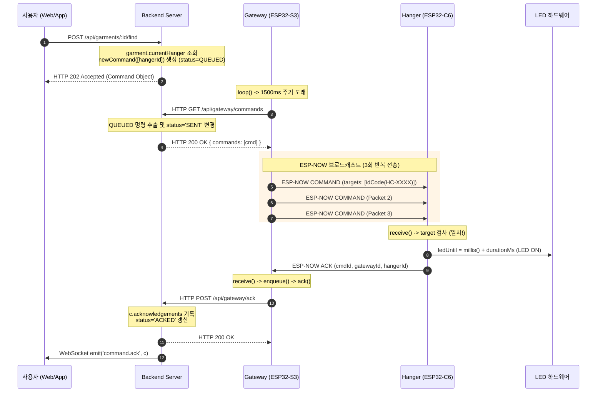

# ESP-NOW 공식 자료 분석 및 PA 프로젝트 구현 연계 가이드

본 문서는 Espressif ESP-IDF ESP-NOW 공식 문서, 공식 예제(`espnow_example_main.c`, `espnow_example.h`)와 현재 PA(Physical AI Smart Wardrobe) 프로젝트 소스 코드(`shared/protocol.h`, `firmware/hanger/src/main.cpp`, `firmware/gateway/src/main.cpp`, `backend/server.js`)를 종합 분석하여, 실제 프로젝트에 필요한 핵심 내용과 동작 방식을 비교 정리한 기술 문서입니다.

---

## 목차
1. [A. ESP-NOW 한눈에 보기](#a-esp-now-한눈에-보기)
2. [B. 공식 ESP-NOW 핵심 동작](#b-공식-esp-now-핵심-동작)
3. [C. 공식 Example 구조 및 핵심](#c-공식-example-구조-및-핵심)
4. [D. PA의 실제 ESP-NOW Protocol (shared/protocol.h)](#d-pa의-실제-esp-now-protocol)
5. [E. Hanger Firmware 동작 흐름 (XIAO ESP32-C6)](#e-hanger-firmware-동작-흐름)
6. [F. Gateway Firmware 동작 흐름 (XIAO ESP32-S3)](#f-gateway-firmware-동작-흐름)
7. [G. Event Flow (Hanger → Gateway → Backend)](#g-event-flow)
8. [H. Find Flow (Backend → Gateway → Hanger → ACK)](#h-find-flow)
9. [I. ESP-NOW Channel 전략](#i-esp-now-channel-전략)
10. [J. Official Espressif vs PA 비교표](#j-official-espressif-vs-pa-비교표)
11. [K. 기술적 위험요소 및 검토사항](#k-기술적-위험요소-및-검토사항)
12. [L. Hardware 도착 후 검증 항목 (Physical Test Checklist)](#l-hardware-도착-후-검증-항목)
13. [M. 코드 수정 필요 여부 판단](#m-코드-수정-필요-여부-판단)

---

## A. ESP-NOW 한눈에 보기

- **개념**: ESP-NOW는 AP 접속 및 3-way 핸드셰이크 과정 없이 IEEE 802.11 Vendor-Specific Action Frame을 이용해 ESP 기기간 초저지연·저전력으로 통신하는 비연결형(Connectionless) 프로토콜입니다.
- **PA 토폴로지**: 
  - **Hanger (XIAO ESP32-C6)**: 배터리/저전력 지향, Wi-Fi AP 연결 없이 ESP-NOW 브로드캐스트로 상태(STATUS) 및 NFC 감지 이벤트(EVENT) 전송, 명령 수신.
  - **Gateway (XIAO ESP32-S3)**: 가정용 2.4GHz Wi-Fi AP에 Station 모드로 연결된 상태에서 동시에 ESP-NOW 수신/송신 수행, 수신 데이터를 HTTP POST로 백엔드 전달.
  - **Backend (Node.js/Express)**: 상태 업데이트 및 의류-옷걸이 매핑(Reconcile), LED 점등 명령(Find) 큐잉 관리.
- **핵심 차별점**:
  - 공식 예제는 동적 유니캐스트 피어 등록 및 1:1 통신을 전제하지만, PA는 **브로드캐스트 채널 + Application 계층 라우팅(HangerId/TargetIds)**을 채택하여 피어 테이블 한계(최대 20개)를 원천 극복함.
  - 802.11 브로드캐스트의 MAC 계층 ACK 부재 문제를 **3회 반복 송신(Jitter Delay) + Application ACK + Sequence/BootId 중복 제거**로 완벽히 보완함.
  - 게이트웨이의 Wi-Fi AP 채널 변동에 대응하기 위해 게이트웨이의 주기적 **BEACON 브로드캐스트**와 행거의 **NVS 채널 저장 및 자동 채널 스윕(Channel Sweep)** 알고리즘이 적용됨.

---

## B. 공식 ESP-NOW 핵심 동작

공식 문서(ESP-IDF API Reference) 기준 주요 항목 및 PA 프로젝트 관점에서의 중요도:

| 공식 기술 항목 | 공식 문서 설명 | PA 프로젝트에서의 의미/중요성 |
|---|---|---|
| **ESP-NOW 정의** | Espressif 정의 비연결형 Wi-Fi 통신 프로토콜. Vendor-Specific Action Frame에 데이터 캡슐화 | 행거가 Wi-Fi AP 접속 오버헤드/연결 지연 없이 즉각 패킷을 송수신할 수 있음 |
| **비연결 통신 방식** | 802.11 결합(Association) 및 인증 없이 MAC 주소 기반 패킷 송수신 | 행거가 슬립에서 깨어나 즉시 패킷을 송신할 수 있어 전력 소모 극소화 |
| **초기화 순서** | `esp_netif_init()` → `esp_wifi_init()` → `esp_wifi_start()` 후 `esp_now_init()` 호출 필수 | 초기화 순서 위반 시 `ESP_ERR_ESPNOW_NOT_INIT` 발생하므로 펌웨어 부팅 순서 준수 필수 |
| **Station/AP 모드** | Station, SoftAP 또는 Station+AP 복합 모드 지원 | 게이트웨이는 Station(AP 접속 중) 모드에서 ESP-NOW를 병행 운용함 |
| **Peer 등록** | 데이터 송신 전 `esp_now_add_peer()`로 목적지 피어 등록 필수 (수신기는 피어 등록 불필요) | PA는 브로드캐스트 MAC(`FF:FF:FF:FF:FF:FF`)을 단일 피어로 등록하여 피어 테이블 고갈 방지 |
| **Broadcast** | MAC 주소 `FF:FF:FF:FF:FF:FF`로 전송. 암호화 미지원. 802.11 MAC ACK 없음 | 1:N 비콘 전파 및 1:Gateway 전송에 사용되며, 신뢰성을 위해 3회 중복 송신 로직 필수 |
| **Unicast** | 특정 MAC 주소로 전송. LMK 암호화 지원. MAC 계층 ACK 자동 발생 | 공식 기능이나 PA는 피어 수 제한(20개) 극복을 위해 Application 타깃팅 브로드캐스트 채널 사용 |
| **Channel의 의미** | 2.4GHz 무선 채널(1~14). 송수신 기기의 무선 채널이 일치해야만 패킷 교환 가능 | 게이트웨이(Wi-Fi 공유기 채널)와 행거의 채널 일치가 통신의 절대적 전제 조건임 |
| **Send Callback** | `esp_now_register_send_cb()`: 전송 결과(`ESP_NOW_SEND_SUCCESS` / `FAIL`) 통보 | Wi-Fi 고우선순위 태스크에서 실행되므로 긴 지연 금지 (PA 게이트웨이는 동기식 전송 활용) |
| **Receive Callback** | `esp_now_register_recv_cb()`: 데이터 수신 시 호출되는 콜백 | Wi-Fi 태스크 컨텍스트이므로 즉시 큐(`RingBuffer`)로 넘겨 비동기 처리해야 안전함 |
| **최대 Payload** | v1.0 기준 250 바이트 (`ESP_NOW_MAX_DATA_LEN`), v2.0 기준 1470 바이트 | PA의 `sw::Packet`은 139바이트로 설계되어 `static_assert(sizeof(Packet)<=250)` 만족 |
| **MAC ACK vs App ACK** | MAC ACK는 802.11 PHY 레벨 전송 성공 여부만 확인(브로드캐스트는 없음). App ACK는 어플리케이션 처리 보장 | 브로드캐스트 사용 시 MAC ACK가 없으므로 행거가 명시적 `ACK` 패킷을 전송하는 App ACK가 필수 |
| **Sequence Number** | 중복 패킷 제거 및 패킷 순서 식별용 번호 | 재전송(3회 송신)으로 인해 동일 패킷이 여러 번 인입될 때 백엔드 중복 업데이트 차단 |
| **Callback 내 부하 회피** | 콜백 함수는 Wi-Fi Driver 내부 태스크에서 실행되므로 블로킹 작업 금지 | I/O 블로킹이나 NVS 쓰기, HTTP 요청 등을 콜백 내부에서 수행하면 Wi-Fi 스택 와치독 발생 위험 |

---

## C. 공식 Example 구조 및 핵심

공식 예제(`espnow_example_main.c`, `espnow_example.h`)의 아키텍처 분석:

```text
[app_main]
  │
  ├── nvs_flash_init()
  ├── example_wifi_init()  ──> esp_netif_init, esp_event_loop_create, esp_wifi_init, esp_wifi_start, esp_wifi_set_channel
  └── example_espnow_init()
        ├── FreeRTOS Queue 생성 (s_example_espnow_queue, size=6)
        ├── esp_now_init()
        ├── esp_now_register_send_cb(example_espnow_send_cb)  ──> 큐에 SEND_CB 이벤트 푸시
        ├── esp_now_register_recv_cb(example_espnow_recv_cb)  ──> 큐에 RECV_CB 이벤트 푸시
        ├── esp_now_set_pmk() / esp_now_add_peer(Broadcast)
        └── xTaskCreate(example_espnow_task)  ──> 메인 루프에서 Queue 소비 및 상태머신 처리
```

### 1. 공식 Example의 통신 메커니즘
- **브로드캐스트 탐색(Discovery)**: 초기에는 브로드캐스트로 자신의 `magic` 값과 상태를 전송.
- **동적 피어 등록**: 브로드캐스트를 수신하면 상대방의 MAC 주소를 추출하여 `esp_now_add_peer()`로 유니캐스트 피어로 등록.
- **매직 넘버 비교**: 매직 넘버가 더 큰 기기가 Master가 되어 상대방에게 주기적 유니캐스트 데이터 전송 개시.
- **CRC16 검증**: 패킷 헤더에 `crc` 필드를 두고 `esp_crc16_le()`로 데이터 무결성 검증.
- **큐 기반 비동기 분리**: Send/Recv Callback에서는 `malloc` 및 `xQueueSend`만 수행하고, 실제 패킷 파싱과 송신 제어는 별도 태스크(`example_espnow_task`)에서 처리.

---

## D. PA의 실제 ESP-NOW Protocol

`shared/protocol.h`에 정의된 실제 패킷 및 데이터 구조입니다.

### 1. `sw::Packet` 구조체 필드 명세 (Total: 139 Bytes)

| 항목 | 실제 Type / Field | 크기 (Bytes) | 역할 및 설명 | 코드 존재 여부 |
|---|---|---|---|:---:|
| **Magic** | `uint16_t magic` | 2 | 프로토콜 식별자 (`0x5753`, ASCII 'WS' = Wardrobe System) | **존재** (`0x5753`) |
| **Version** | `uint8_t version` | 1 | 프로토콜 버전 (`VERSION = 1`) | **존재** (`1`) |
| **Packet Type** | `sw::Type type` | 1 | 패킷 유형 (`BEACON`, `STATUS`, `EVENT`, `COMMAND`, `ACK`) | **존재** (enum Type) |
| **Gateway ID** | `char gatewayId[16]` | 16 | 게이트웨이 식별 문자열 (예: `"GW-00A1B2"`) | **존재** |
| **Hanger ID** | `char hangerId[16]` | 16 | 옷걸이 식별 문자열 (예: `"HC-001A2B"`) | **존재** |
| **State** | `sw::State state` | 1 | 의류 거치 상태 (`PRESENT`, `EMPTY`, `UNKNOWN_TAG`, `UNSTABLE`) | **존재** (enum State) |
| **UID Length** | `uint8_t uidLength` | 1 | NFC Tag UID 길이 (0, 4, 7) | **존재** |
| **UID** | `uint8_t uid[7]` | 7 | NFC Tag UID 바이트 배열 (Mifare 4/7-byte) | **존재** |
| **Sequence** | `uint32_t sequence` | 4 | 패킷 단조 증가 시퀀스 번호 (중복 필터링용) | **존재** |
| **Boot ID** | `uint32_t bootId` | 4 | 재부팅 시 생성되는 난수 ID (재부팅 감지 및 중복 리셋용) | **존재** |
| **Command ID** | `uint32_t commandId` | 4 | 서버에서 발급한 명령 숫자 식별자 | **존재** |
| **Command** | `sw::Command command`| 1 | 실행할 명령 종류 (`LED_BLINK = 1`) | **존재** (enum Command)|
| **Duration** | `uint16_t durationMs` | 2 | 명령 동작 지속 시간 (밀리초 단위, 기본 8000ms) | **존재** |
| **Target Count**| `uint8_t targetCount` | 1 | 타깃 옷걸이 ID 목록 개수 (최대 16개) | **존재** |
| **Target List** | `uint32_t targetIds[16]`| 64 | 타깃 옷걸이 ID의 16진수 변환 해시값 배열 (`idCode`) | **존재** (`MAX_TARGETS=16`)|
| **Channel** | *(Packet 내부 필드 없음)*| - | 패킷 내부에는 없음. 게이트웨이가 업로드 시 `WiFi.channel()` 추가 | **코드 내부 필드 없음** |
| **Firmware Ver**| `char firmware[12]` | 12 | 펌웨어 버전 문자열 (예: `"1.0.0"`) | **존재** |
| **Error Flags** | `uint32_t errorFlags` | 4 | 에러 비트마스크 (예: NFC 초기화 실패 시 1) | **존재** |
| **Checksum** | `uint32_t checksum` | 4 | FNV-1a 32비트 해시 체크섬 | **존재** |

- **크기 검증**: 총 139 바이트로 `static_assert(sizeof(Packet) <= 250)` 검증 통과.

### 2. 패킷 유틸리티 함수 (`shared/protocol.h`)
- `uint32_t checksum(const Packet& p)`: 패킷의 `checksum` 필드를 제외한 135바이트에 대해 FNV-1a 해시(`offset_basis=2166136261u`, `prime=16777619u`) 계산.
- `void seal(Packet& p)`: 체크섬을 계산하여 `p.checksum`에 기록.
- `bool valid(const Packet& p)`: `p.magic == 0x5753 && p.version == 1 && p.checksum == checksum(p)` 일치 확인.
- `uint32_t idCode(const char* id)`: `"HC-0012AB"` 문자열에서 16진수 문자만 추출하여 32비트 정수로 압축 변환 (패킷 크기 절약).
- `bool target(const Packet& p, const char* id)`: 현재 옷걸이의 `idCode`가 `p.targetIds` 목록에 포함되어 있는지 검사.

### 3. 패킷 타입별 송수신 명세

| Packet Type | Sender | Receiver | Purpose | 발생 시점 및 조건 |
|---|---|---|---|---|
| **BEACON** (`1`) | Gateway | Hanger (Broadcast) | Gateway 존재 알림 및 동기화 | 게이트웨이가 2000ms 주기마다 브로드캐스트 전송 |
| **STATUS** (`2`) | Hanger | Gateway (Broadcast) | 주기적 헬스체크 및 상태 보고 | 행거가 5000ms + Jitter 주기로 1회 전송 (Heartbeat) |
| **EVENT** (`3`) | Hanger | Gateway (Broadcast) | 의류 거치/제거 상태 즉시 보고 | NFC 스캔 상태 변경(`transition`) 시 3회 반복 전송 |
| **COMMAND** (`4`)| Gateway | Hanger (Broadcast) | 의류 찾기 LED 점등 지시 | 서버에서 명령 폴링 시 3회 반복 전송 (`LED_BLINK`) |
| **ACK** (`5`) | Hanger | Gateway (Broadcast) | 명령 수신 및 실행 완료 응답 | 자신에게 온 COMMAND 수신 즉시 응답 전송 |

---

## E. Hanger Firmware 동작 흐름 (XIAO ESP32-C6)

파일: `firmware/hanger/src/main.cpp`

### 1. Hanger 순방향 흐름: 부팅부터 이벤트 보고
```text
[Boot / setup()]
  │
  ├── Serial, LED Pin(PIN_LED=D1) 초기화
  ├── MAC 기반 ID 생성: hanger = "HC-" + EfuseMac 하위 24비트
  ├── bootId = esp_random() 생성
  ├── Preferences (NVS)에서 저장된 "channel" (기본 1) 로드
  ├── I2C(PIN_SDA=D4, PIN_SCL=D5) & Adafruit_PN532 초기화 -> nfcReady 설정
  ├── WiFi.mode(WIFI_STA) & WiFi.disconnect()
  ├── setChannel(channel) -> esp_wifi_set_channel(channel)
  ├── esp_now_init() & esp_now_register_recv_cb(receive)
  ├── addBroadcast() -> 0xFF:0xFF:0xFF:0xFF:0xFF:0xFF 피어 등록
  └── report(true) -> 부팅 즉시 최초 EVENT 브로드캐스트
        │
[Main Loop / loop()]
  │
  ├── LED 타이머 체크: led(millis() < ledUntil)
  │
  ├── NFC 주기적 스캔: scanNfc() (주기: NFC_SCAN_INTERVAL_MS 220ms + bootId%73)
  │     ├── PN532 Passive Target ID 폴링 (타임아웃 35ms)
  │     ├── UID 디바운싱:
  │     │     ├── 동일 UID 3회 감지(NFC_PRESENT_CONFIRM_COUNT) -> transition(PRESENT)
  │     │     ├── 다른 UID 3회 감지(NFC_UID_CHANGE_CONFIRM_COUNT) -> transition(PRESENT)
  │     │     └── 미감지 8회 누적(NFC_EMPTY_CONFIRM_COUNT) -> transition(EMPTY)
  │     └── transition(s):
  │           └── state 변경 시 report(true) 호출
  │
  ├── 주기적 Heartbeat: report(false) (주기: HEARTBEAT_MIN_MS 5000ms + bootId%3000ms)
  │
  └── 채널 복구 검사: recoverChannel() (마지막 비콘 수신 15초 경과 시 채널 스윕)
```

- **주요 함수 및 변수**:
  - `void report(bool event)`: `fill(p, event ? EVENT : STATUS)` 후 `send(p)` 실행. 이벤트 시 3회 반복(`delay(18 + esp_random() % 70)`).
  - `void transition(sw::State s)`: 상태 변경 시 `report(true)` 호출.
  - `void scanNfc()`: `nfc.readPassiveTargetID` 호출 및 `presentCount`, `emptyCount`, `uidChangeCount` 카운터 처리.
  - `void setChannel(uint8_t ch)`: Promiscuous 모드를 거쳐 Wi-Fi 채널 변경.

### 2. Hanger 역방향 흐름: 게이트웨이 명령 수신 및 처리
```text
[ESP-NOW 수신 패킷 인입]
  │
  ▼
[receive(const uint8_t*, const uint8_t* data, int len)]
  │
  ├── 길이 및 체크섬 검증: len == sizeof(Packet) && sw::valid(p)
  │
  ├── (Case A) p.type == BEACON:
  │     ├── lastBeacon = millis() 갱신 (비콘 타이머 리셋)
  │     └── prefs.putUChar("channel", channel) (현재 채널 NVS 저장)
  │
  └── (Case B) p.type == COMMAND && sw::target(p, hanger.c_str()):
        ├── targetIds 리스트에 자신(idCode(hanger))이 포함되었는지 확인
        ├── p.command == LED_BLINK 확인 -> ledUntil = millis() + p.durationMs 설정
        └── ack(p) 호출:
              ├── Packet a 생성 (type = ACK, gatewayId = cmd.gatewayId, commandId = cmd.commandId)
              └── send(a) -> 게이트웨이로 응답 패킷 브로드캐스트
```

---

## F. Gateway Firmware 동작 흐름 (XIAO ESP32-S3)

파일: `firmware/gateway/src/main.cpp`

### 1. Hanger → Gateway → Backend 흐름
```text
[Hanger ESP-NOW 패킷 수신]
  │
  ▼
[receive(const uint8_t*, const uint8_t* data, int len)] (Wi-Fi Task ISR 컨텍스트)
  │
  ├── 유효성 검사: len == sizeof(Packet) && sw::valid(p)
  └── enqueue(p) -> 임계구역(portENTER_CRITICAL(&mux))을 통해 링버퍼(queue[32])에 삽입
        │
[Main Loop / loop()] (Main Task 컨텍스트)
  │
  ▼
[dequeue(p) (최대 루프당 6개 소비)]
  │
  ├── (Case A) p.type == ACK:
  │     └── ack(p) 호출:
  │           └── HTTP POST /api/gateway/ack
  │               Body: { commandId, hangerId, result: "OK", errorCode }
  │
  └── (Case B) p.type == STATUS || p.type == EVENT:
        └── upload(p) 호출:
              └── HTTP POST /api/gateway/status
                  Body: { gatewayId, hangerId, state, tagUid, sequence, bootId,
                          channel: WiFi.channel(), firmwareVersion, errorFlags }
                  (실패 시: enqueue(p)로 재큐잉 및 80ms 지연)
```

### 2. Backend → Gateway → Hanger 흐름
```text
[Main Loop / loop()]
  │
  ├── 1500ms 주기 도래 (millis() - cloudAt > 1500)
  │     │
  │     ▼
  └── fetchCommands() 호출:
        ├── HTTP GET /api/gateway/commands
        │   Response: { commands: [ { numericId, durationMs, targets: ["HC-0012AB", ...] } ] }
        │
        └── JSON 파싱 및 Packet 구성:
              ├── p.type = sw::Type::COMMAND
              ├── p.commandId = numericId
              ├── p.command = LED_BLINK
              ├── p.durationMs = durationMs (기본 8000ms)
              ├── p.targetCount = min(targets.size(), 16)
              ├── p.targetIds[i] = sw::idCode(targetId)
              │
              └── 3회 중복 송신 (send(p) + delay(25 + esp_random() % 50))
```

### 3. 주기적 비콘 전송
- `loop()` 내에서 2000ms 주기(`millis() - beaconAt > 2000`)로 `beacon()` 호출.
- `p.type = BEACON`, `gatewayId = gateway`, `firmware = "1.0.0"` 기록 후 브로드캐스트 전송.

---

## G. Event Flow (상태 변경 상세 흐름)



---

## H. Find Flow (의류 찾기 명령 상세 흐름)



---

## I. ESP-NOW Channel 전략

ESP-NOW는 송수신기 간의 2.4GHz 무선 채널이 일치하지 않으면 패킷이 완전히 드롭됩니다. PA 프로젝트의 채널 관리 전략은 다음과 같습니다.

### 1. 채널 동작 및 동기화 메커니즘
- **Gateway 채널 결정**: 
  - 게이트웨이는 `WiFi.begin(WIFI_SSID, WIFI_PASSWORD)`로 공유기(AP)에 접속함.
  - 접속 완료 시 공유기가 할당한 채널(`WiFi.channel()`)로 게이트웨이 Wi-Fi 및 ESP-NOW 채널이 고정됨.
- **Gateway 비콘 전송**: 
  - 게이트웨이는 2000ms마다 `BEACON` 패킷을 브로드캐스트 전송함.
- **Hanger 채널 락인 (Lock-in)**:
  - 행거는 NVS(Flash)에 저장된 이전 채널(`prefs.getUChar("channel", 1)`)로 부팅.
  - 게이트웨이의 `BEACON`을 수신하면 `lastBeacon = millis()`를 갱신하고, 해당 채널을 NVS에 갱신 저장함.
- **Hanger 채널 복구 (Channel Sweep Recovery)**:
  - 만약 공유기 재부팅이나 간섭으로 AP 채널이 변경되어 15초(`millis() - lastBeacon >= 15000`) 동안 비콘을 수신하지 못하면 행거는 복구 모드로 진입.
  - 420ms(`CHANNEL_DWELL_MS`)마다 채널을 1씩 증가시키며(1 → 2 → ... → 13 → 1) 비콘을 탐색(`recoverChannel()`).
  - 변경된 게이트웨이 채널에서 비콘을 1회라도 수신하면 즉시 해당 채널에 락인되고 NVS에 영구 저장됨.

### 2. 채널 검증 상태 구분
- `SOFTWARE LOGIC VERIFIED`: 
  - 비콘 송신 루프(2000ms), 행거의 비콘 타임아웃(15s), 420ms Dwell Time 채널 스윕 알고리즘, NVS 읽기/쓰기 로직.
- `REQUIRES_PHYSICAL_RF_TEST`:
  - 게이트웨이가 공유기 통신(HTTP POST/GET) 중 발생하는 채널 점유 시간 동안 ESP-NOW 패킷 누락률.
  - 행거가 채널 스윕 중(1~13 채널 순회, 최대 5.46초 소요) 비콘을 놓치지 않고 1사이클 내에 안정적으로 락인되는지 여부.
  - 공유기가 2.4GHz Auto 채널 전환(DFS/간섭 회피) 시 실제 락인 소요 시간.

---

## J. Official Espressif vs PA 비교표

| 항목 (Topic) | Espressif Official Example | PA Current Implementation | 구현 상태 판단 | 분석 및 차이점 상세 |
|---|---|---|:---:|---|
| **Wi-Fi 초기화** | ESP-IDF C API (`esp_wifi_init`, `esp_wifi_start`) | Arduino ESP32 core (`WiFi.mode`, `WiFi.begin`) | **MATCH** | 플랫폼 라이브러리 추상화 차이일 뿐 내부적으로 동일 IDF 호출 |
| **ESP-NOW 초기화** | `esp_now_init()` 직접 호출 | `esp_now_init()` 직접 호출 | **MATCH** | 동일 |
| **Peer 관리** | Unicast 피어를 수신 시마다 동적 추가 (`esp_now_add_peer`) | 브로드캐스트(`FF:..:FF`) 단일 피어만 등록 | **CUSTOM_BUT_VALID** | 20개 피어 테이블 한계 회피를 위한 현명한 아키텍처 선택 |
| **Broadcast 활용** | 초기 탐색(Discovery)에만 사용 | 비콘, 이벤트, 상태, 명령 전송의 기본 채널 | **CUSTOM_BUT_VALID** | 1:N 구조에 최적화 |
| **Unicast 활용** | 메인 데이터 전송에 사용 | 사용하지 않음 (페이로드 내부 ID 필터링) | **CUSTOM_BUT_VALID** | 타깃팅을 상위 어플리케이션 계층(`targetIds`)에서 처리 |
| **Channel 동기화** | `menuconfig`에 고정 채널 지정 | Beacon 브로드캐스트 + NVS 저장 + 자동 채널 스윕 | **CUSTOM_BUT_VALID** | AP 채널 동적 변경 환경에 대응한 우수한 자율 복구 구조 |
| **Send Callback** | 큐를 통해 `send_cb` 이벤트를 메인 태스크로 전달 | 미사용 (함수 반환값 `ESP_OK`로 전송 요청 확인) | **CUSTOM_BUT_VALID** | 브로드캐스트는 MAC ACK가 없으므로 `send_cb` 의존성 불필요 |
| **Receive Callback** | FreeRTOS 큐로 포인터 전달 후 비동기 파싱 | Gateway: Spinlock 링버퍼 큐<br/>Hanger: 콜백 내 즉시 처리 | **NEEDS_REVIEW** | Hanger 콜백 내 NVS 쓰기(`prefs.putUChar`) 존재 (블로킹 위험) |
| **ACK 방식** | MAC 계층 ACK (`send_cb`의 `ESP_NOW_SEND_SUCCESS`) | Application 계층 명시적 `Type::ACK` 패킷 송수신 | **CUSTOM_BUT_VALID** | 브로드캐스트 사용에 따른 완벽한 보완책 |
| **Sequence Number** | 패킷 헤더 내 16비트 `seq_num` | 패킷 내 32비트 `sequence` + `bootId` 조합 | **CUSTOM_BUT_VALID** | 재부팅 시퀀스 역전 및 중복 패킷을 완벽히 방어 |
| **Retry 메커니즘** | 단일 전송 후 실패 시 재시도 태스크 | 3회 중복 송신 + 무작위 Jitter Delay (18~88ms) | **CUSTOM_BUT_VALID** | 단방향 비동기 무선 환경에서 패킷 도달률을 대폭 상승시킴 |
| **중복 패킷 제거** | 공식 예제에 별도 로직 없음 | Backend 서버에서 `bootId` & `lastSequence` 비교 필터링 | **CUSTOM_BUT_VALID** | 3회 중복 송신에 따른 부작용을 백엔드에서 원천 차단 |
| **Checksum / 검증** | CRC16 (`esp_crc16_le`) | FNV-1a 32-bit Hash + Magic(`0x5753`) + Version | **CUSTOM_BUT_VALID** | 32비트 체크섬으로 데이터 무결성 철저히 보장 |
| **Gateway Discovery** | Magic 넘버 비교 Master 선출 | Gateway 주기적 비콘 브로드캐스트 (2000ms) | **CUSTOM_BUT_VALID** | Centralized 게이트웨이 모델에 표준적인 설계 |
| **Channel Recovery** | 공식 예제에 없음 | 15초 비콘 타임아웃 시 420ms Dwell 채널 스윕 | **REQUIRES_PHYSICAL_TEST** | 소프트웨어 로직은 완벽하나 실물 RF 환경 락인 성능 검증 필요 |

- **판단 기준 요약**:
  - `MATCH`: 공식 권장 사항 및 표준 API와 정확히 일치.
  - `CUSTOM_BUT_VALID`: 프로젝트 요구사항(다수 옷걸이, AP 연동)에 맞춘 커스텀 구현이며 구조적으로 타당함.
  - `NEEDS_REVIEW`: 동작은 가능하나 Wi-Fi ISR/태스크 컨텍스트 블로킹 등 잠재적 위험이 있어 검토가 필요한 항목.
  - `REQUIRES_PHYSICAL_TEST`: 소프트웨어 로직은 유효하나 물리적 하드웨어 및 RF 환경에서 실측 검증이 필요한 항목.

---

## K. 기술적 위험요소 및 검토사항

현재 코드 분석 결과 식별된 잠재적 위험 요소:

1. **Hanger Receive Callback 내 NVS 쓰기 블로킹 위험 (`NEEDS_REVIEW`)**:
   - 파일: `firmware/hanger/src/main.cpp:24`
   - 코드: `if(p.type==sw::Type::BEACON){ lastBeacon=millis(); prefs.putUChar("channel",channel); return; }`
   - 위험: `receive` 콜백은 Wi-Fi Driver 내부 태스크에서 호출됩니다. `prefs.putUChar`는 Flash I/O를 수행하므로 밀리초 단위의 지연이 발생하며, 2초마다 들어오는 비콘마다 Flash 쓰기를 수행하면 Flash 마모(Wear-out) 및 Wi-Fi 태스크 와치독 트리거 가능성이 있습니다.
   - 권장 개선 방향: 채널이 실제로 변경되었을 때(`oldChannel != channel`)만 쓰거나, 메인 루프로 플래그를 넘겨 비동기 저장하도록 개선 필요.

2. **Hanger Receive Callback 내 ACK 패킷 즉시 송신 (`NEEDS_REVIEW`)**:
   - 파일: `firmware/hanger/src/main.cpp:24`
   - 코드: `if(p.type==sw::Type::COMMAND...){ ... ack(p); }`
   - 위험: 수신 콜백(Wi-Fi 태스크) 내부에서 `esp_now_send()`를 직접 호출하면 Wi-Fi 스택 리소스 락 경합이 발생할 수 있습니다.
   - 권장 개선 방향: ACK 요청 플래그를 세우고 메인 `loop()`에서 전송하는 것이 안정적임.

3. **Gateway의 HTTP 폴링 주기 (1500ms 지연)**:
   - 앱에서 "옷 찾기(Find)" 버튼을 누른 후 최대 1.5초 후에 게이트웨이가 명령을 가져오므로 반응 지연이 발생함. (향후 WebSocket 클라이언트로 개선 가능하나 현재 프로토타입으로는 동작 가능).

4. **Gateway의 Wi-Fi 동시 운용 시 ESP-NOW 수신율**:
   - ESP32-S3가 Wi-Fi 공유기와 TCP/HTTP 통신(데이터 업로드/다운로드)을 하는 순간 RF 모뎀이 Wi-Fi 패킷 처리에 우선순위를 두어 동시간대에 인입되는 ESP-NOW 패킷이 드롭될 수 있음. (3회 중복 전송으로 대부분 보완됨).

---

## L. Hardware 도착 후 검증 항목 (Physical Test Checklist)

실제 Seeed Studio XIAO ESP32-C6 및 XIAO ESP32-S3 보드가 도착했을 때 반드시 측정·검증해야 하는 항목:

| 검증 ID | 테스트 항목 | 검증 방법 및 조건 | 합격 기준 |
|---|---|---|---|
| **RF-01** | C6 ↔ S3 기본 통신 | 1m 거리 개활지에서 STATUS / EVENT 송수신 | 패킷 수신율 100% |
| **RF-02** | 3회 중복 송신 패킷 도달률 | 행거 상태 변경 시 게이트웨이 수신 로그 확인 | 3개 중 최소 1개 이상 수신율 99.9% 이상 |
| **RF-03** | 옷장/벽 투과 거리 측정 | 옷장 문 닫힘, 옷 10벌 밀집 상태에서 게이트웨이와 통신 | 5m 이상 거리에서 안정적 수신 |
| **RF-04** | 다수 Hanger 동시 전송 간섭 | 옷걸이 5~10대가 동시에 상태 변경(옷 꺼냄) 발생 | CSMA/CA 및 랜덤 Jitter(18~88ms)를 통한 충돌 회피 확인 |
| **RF-05** | Wi-Fi + ESP-NOW 공존 안정성 | 게이트웨이가 대용량 HTTP 통신 중 행거 패킷 수신 | 패킷 유실 없이 링버퍼 정상 인입 확인 |
| **RF-06** | 채널 자동 복구 (Channel Sweep) | 공유기 2.4GHz 채널 강제 변경 (예: Ch 1 → Ch 11) | 행거가 15초 후 스윕 시작하여 10초 이내 새 채널 락인 |
| **RF-07** | 부팅 및 딥슬립 복귀 시간 | 전원 투입부터 최초 EVENT 패킷 전송까지 시간 | 200ms 이내 최초 패킷 방출 확인 |

---

## M. 수정 필요 여부 판단

### 1. 바로 수정해야 할 것 (Immediate Refactoring)
- **없음 (현재 상태 유지)**: 사용자의 지침에 따라 현재 단계에서는 코드를 임의로 수정하지 않고 대기합니다.

### 2. 향후 실물 도착 전/후 검토 및 수정 고려 사항
- **[Hanger] Receive Callback 최적화**:
  - 비콘 수신 시 매번 `prefs.putUChar`를 호출하는 코드를 "채널이 실제로 바뀌었을 때만" 저장하도록 조건문 추가.
  - 콜백 내부에서 직접 `ack()` 송신 대신 메인 루프 처리로 분리.
- **[Gateway] HTTP 업로드 실패 시 재큐잉 지연 완화**:
  - 현재 `enqueue(p); delay(80);` 형태로 되어 있어 메인 루프를 일시 블로킹하므로, 백오프 타이머 방식으로 개선 검토.

### 3. 수정할 필요가 없는 것 (Keep As Is)
- `shared/protocol.h`의 패킷 레이아웃, 체크섬(FNV-1a), 매직넘버, ID 압축(`idCode`) 알고리즘.
- 브로드캐스트 기반 Application Routing 및 3회 중복 송신 전략.
- 백엔드 서버(`server.js`)의 `sequence`/`bootId` 기반 중복 제거 및 `reconcile` 로직.
