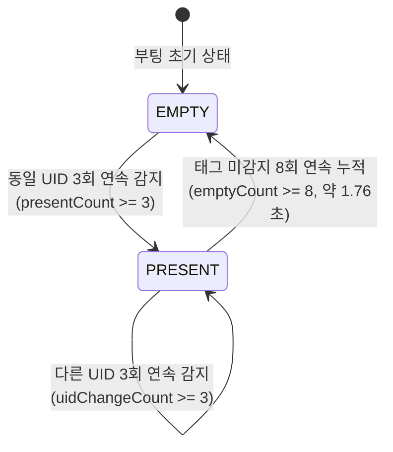

# PN532 NFC 모듈 공식 자료 분석 및 PA 프로젝트 연계 가이드

본 문서는 NXP PN532 공식 데이터시트(`PN532_C1.pdf`), 유저 매뉴얼(`PN532_USERGUIDE.pdf`), 실제 구매한 PN532 V3 모듈, 그리고 Adafruit-PN532 라이브러리를 바탕으로 현재 PA(Physical AI Smart Wardrobe) 프로젝트의 행거 펌웨어([`firmware/hanger/src/main.cpp`](file:///C:/Users/hpo20/OneDrive/바탕%20화면/Project%20List/pysical%20AI/PA/firmware/hanger/src/main.cpp)) 및 프로토콜([`shared/protocol.h`](file:///C:/Users/hpo20/OneDrive/바탕%20화면/Project%20List/pysical%20AI/PA/shared/protocol.h))과의 연계 방식을 정리한 기술 문서입니다.

---

## 📌 주요 레퍼런스 링크
- **구매 모듈 (PN532 NFC RFID V3 모듈)**: https://smartstore.naver.com/misoparts/products/11470443972
- **사용 라이브러리 (Adafruit-PN532)**: https://github.com/adafruit/Adafruit-PN532
- **공식 문서**: `datesheet/PN532_C1.pdf` (NXP Product Data Sheet Rev 3.6), `datesheet/PN532_USERGUIDE.pdf`

---

## 1. C6와 PN532의 실제 통신 인터페이스
- **사용 인터페이스**: **I2C (Inter-Integrated Circuit)**
- **구현 방식**:
  - `Wire.h` 및 `Adafruit_PN532.h` 사용
  - 객체 선언: `Adafruit_PN532 nfc(PN532_IRQ, PN532_RESET, &Wire);`
  - 버스 초기화: `Wire.begin(PIN_SDA, PIN_SCL); Wire.setClock(100000);` (Standard Mode 100 kHz)
  - 칩 초기화: `nfc.begin();` → `nfc.SAMConfig();` (Normal Mode 활성화)
- **NXP 공식 규격 매핑**:
  - PN532 I2C 7-bit 슬레이브 주소는 **`0x24`** (Write: 0x48, Read: 0x49)이며, Adafruit 라이브러리의 기본 주소(`PN532_I2C_ADDRESS = 0x48 >> 1 = 0x24`)와 정확히 일치함.
  - 데이터시트 Section 8.3.2 (Table 72)에 따라 I2C 인터페이스를 사용하려면 하드웨어 핀 `I0=0`, `I1=1`로 설정되어야 함.

---

## 2. 현재 코드의 핀 맵 (XIAO ESP32-C6)
[`firmware/hanger/src/main.cpp`](file:///C:/Users/hpo20/OneDrive/바탕%20화면/Project%20List/pysical%20AI/PA/firmware/hanger/src/main.cpp) 14행 기준:

| 신호 이름 | 코드 정의 매크로 | XIAO ESP32-C6 Pin | ESP32-C6 GPIO | PN532 모듈 핀 | 역할 및 설명 |
|---|---|---|---|---|---|
| **SDA** | `PIN_SDA` | `D4` | `GPIO 22` | SDA | I2C Data Line (양방향 오픈드레인) |
| **SCL** | `PIN_SCL` | `D5` | `GPIO 23` | SCL | I2C Clock Line (100kHz) |
| **IRQ** | `PN532_IRQ` | `D2` | `GPIO 2` | IRQ (P70_IRQ) | 인터럽트 신호선 (데이터 준비 완료 알림) |
| **RST** | `PN532_RESET` | `D3` | `GPIO 21` | RSTPD_N / RSTO | 하드웨어 리셋 신호선 (Active Low) |
| **LED** | `PIN_LED` | `D1` | `GPIO 1` | - | 옷걸이 찾기 인디케이터 LED |

---

## 3. UID 바이트 규격 및 저장/전송 형식

### UID 바이트 크기
- ISO/IEC 14443A 표준 태그 규격:
  - **Single Size (4 Bytes)**: Mifare Classic 1K, NTAG 일반형
  - **Double Size (7 Bytes)**: NTAG213/215/216, Mifare Ultralight
  - **Triple Size (10 Bytes)**: 일부 특수 보안 태그 (PA 시스템에서는 의류용 4~7바이트 태그 사용)

### 계층별 저장 및 전송 형식
1. **Hanger Firmware ([`main.cpp`](file:///C:/Users/hpo20/OneDrive/바탕%20화면/Project%20List/pysical%20AI/PA/firmware/hanger/src/main.cpp))**:
   - 변수: `uint8_t currentUid[7]{}; uint8_t currentLen = 0;`
   - 스캔 함수: `nfc.readPassiveTargetID(PN532_MIFARE_ISO14443A, u, &len, 35)`
   - Raw binary 바이트 배열로 보관.
2. **ESP-NOW 프로토콜 ([`protocol.h`](file:///C:/Users/hpo20/OneDrive/바탕%20화면/Project%20List/pysical%20AI/PA/shared/protocol.h))**:
   - `sw::Packet` 내 바이너리 필드:
     - `uint8_t uidLength;` (실제 길이 0, 4, 7)
     - `uint8_t uid[7];` (바이트 배열)
3. **Gateway Firmware ([`main.cpp`](file:///C:/Users/hpo20/OneDrive/바탕%20화면/Project%20List/pysical%20AI/PA/firmware/gateway/src/main.cpp))**:
   - `uidHex()` 함수를 통해 2자리 16진수 대문자 문자열로 변환 (예: `[0x04, 0xA1, 0xB2, 0xC3]` → `"04A1B2C3"`).
4. **Backend Server ([`server.js`](file:///C:/Users/hpo20/OneDrive/바탕%20화면/Project%20List/pysical%20AI/PA/backend/server.js))**:
   - JSON `tagUid: "04A1B2C3"` (String) 형태로 수신하여 의류 매핑(`reconcile()`) 및 DB 저장.

---

## 4. NFC Scan → UID → Hanger State 변화 흐름



- **디바운싱 파라미터 ([`config.example.h`](file:///C:/Users/hpo20/OneDrive/바탕%20화면/Project%20List/pysical%20AI/PA/firmware/hanger/include/config.example.h))**:
  - `NFC_SCAN_INTERVAL_MS = 220` (스캔 주기 220ms + `bootId % 73`)
  - `NFC_PRESENT_CONFIRM_COUNT = 3` (3회 일치 시 거치 확정)
  - `NFC_UID_CHANGE_CONFIRM_COUNT = 3` (3회 일치 시 옷 교체 확정)
  - `NFC_EMPTY_CONFIRM_COUNT = 8` (8회 연속 미감지 시 빈 옷걸이 확정)
- **상태 전이 처리 (`transition(s)`)**:
  - 상태가 변경될 때만 `transition()`이 호출되어 `report(true)`를 실행.
  - 무선 패킷 낭비를 방지하고, 상태 변경 순간에만 `EVENT` 패킷을 3회 중복 송출함.

---

## 5. ESP-NOW 패킷 내 UID 위치
[`shared/protocol.h`](file:///C:/Users/hpo20/OneDrive/바탕%20화면/Project%20List/pysical%20AI/PA/shared/protocol.h)의 `sw::Packet` 구조체 정의:

```cpp
struct __attribute__((packed)) Packet {
    uint16_t magic = 0x5753;
    uint8_t  version = VERSION;
    Type     type = Type::STATUS;
    char     gatewayId[16]{};
    char     hangerId[16]{};
    State    state = State::EMPTY;
    uint8_t  uidLength = 0;        // <--- [UID 길이] (1 Byte: 0, 4, 7)
    uint8_t  uid[7]{};             // <--- [UID 바이너리 데이터] (7 Bytes)
    uint32_t sequence = 0;
    ...
};
```

---

## 6. 공식 PN532 자료와 현재 코드의 정합성 검토

| 검토 항목 | 공식 데이터시트 / 매뉴얼 규격 | 현재 코드 구현 | 충돌/정합 여부 |
|---|---|---|:---:|
| **통신 프로토콜** | I2C, SPI, HSU 중 택1 (Exclusive) | I2C (`Wire.h`) 사용 | **정합 (MATCH)** |
| **I2C 버스 속도** | Standard (100kHz), Fast (400kHz) | `Wire.setClock(100000)` (100kHz) | **정합 (MATCH)** |
| **I2C 슬레이브 주소** | 7-bit: `0x24` | Adafruit 라이브러리 기본 `0x24` | **정합 (MATCH)** |
| **SAM 설정** | Normal mode (PCD 리더기 모드) | `nfc.SAMConfig()` 호출 | **정합 (MATCH)** |
| **타임아웃 제어** | `setPassiveActivationRetries` 레지스터 | `nfc.setPassiveActivationRetries(0x01)` 및 `timeout=35ms` | **정합 (MATCH)** |
| **동작 전압 레벨** | `PVDD = 1.6V ~ 3.6V` (3.3V I/O 호환) | XIAO C6 3.3V Logic과 직결 | **정합 (MATCH)** |

---

## 7. 실제 구매 Breakout Board에서 확인해야 하는 항목

1. **DIP 스위치 / 점퍼 설정 (I0, I1 선택)**:
   - 구매한 보드(빨간색 PN532 V3 모듈)의 상단 DIP 스위치를 반드시 **I2C 모드**로 설정해야 함.
   - **I2C 설정**: **`CH1 = 0 (OFF/L), CH2 = 1 (ON/H)`** (보드 실크스크린의 `I2C: 0 1` 인쇄 참조).
2. **I2C 풀업 저항 (Pull-up Resistor)**:
   - 보드 상에 10kΩ SDA/SCL 풀업 저항이 기본 실장되어 있는지 확인 (대부분의 V3 모듈에 실장됨).
3. **전원 공급 전압 (VCC)**:
   - 모듈 온보드에 3.3V LDO가 내장되어 있어 3.3V 또는 5V(VBUS) 모두 입력 가능하나, C6의 3.3V 핀에 연결하는 것이 신호 레벨 일치에 가장 안전함.

---

## 8. 실물 도착 후 필수 테스트 (Validation Checklist)

- [ ] **TEST-NFC-01 (I2C 통신 및 펌웨어 버전 확인)**:
  - 부팅 시 `nfc.getFirmwareVersion()` 호출 결과 `0x32` 반환 및 `[NFC] READY version=00000132` 시리얼 로그 확인.
- [ ] **TEST-NFC-02 (4-byte Mifare Classic 태그 인식)**:
  - 의류 라벨용 4바이트 태그 터치 시 즉시 UID 인식 및 `[STATE] 1 (PRESENT)` 전이 확인.
- [ ] **TEST-NFC-03 (7-byte NTAG213/215 태그 인식)**:
  - 7바이트 NTAG 스티커 터치 시 7바이트 UID 온전 인식 확인.
- [ ] **TEST-NFC-04 (태그 이탈 디바운싱 확인)**:
  - 옷을 옷걸이에서 벗겼을 때 8회 연속 미감지(약 1.76초) 후 `EMPTY`로 상태 전이되는지 확인.
- [ ] **TEST-NFC-05 (비접촉 상태 루프 지연 측정)**:
  - 태그가 없을 때 `readPassiveTargetID(..., 35)`가 35ms 이내에 즉시 리턴하여 ESP-NOW 비콘 수신 및 Heartbeat에 영향을 주지 않는지 확인.
